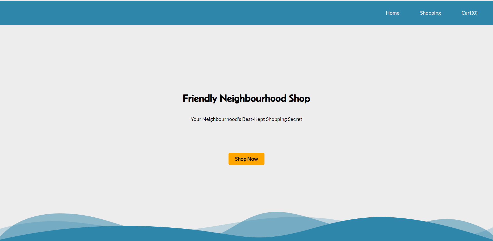
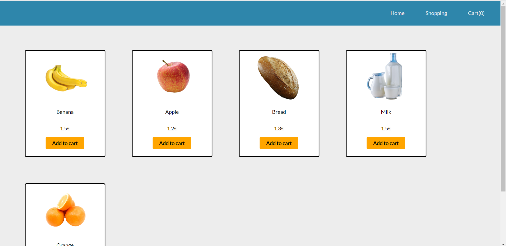
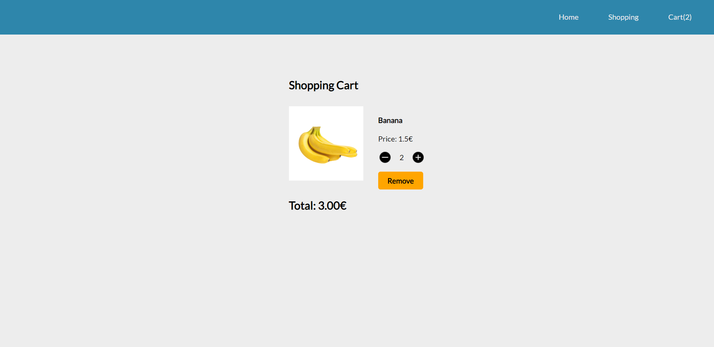

# Shopping Cart

This is a simple shopping app built with React. It allows users to browse items, add them to the cart, and view the cart.

## Technologies Used

- React
- JavaScript
- HTML
- CSS

## Features

- View a list of available items
- Add items to the cart
- Remove items from the cart
- View the total number of items in the cart

## Demo

You can play with project online by visiting [Shopping Cart Demo](https://ikojun00.github.io/shopping-cart/)

## Screenshots

